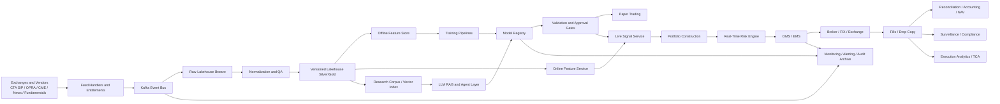
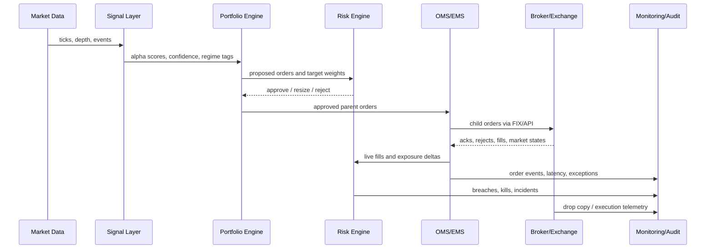
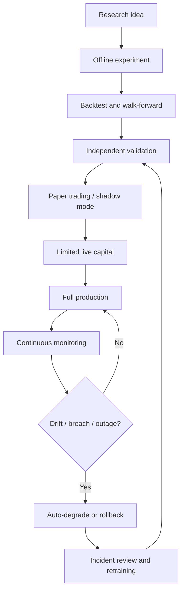
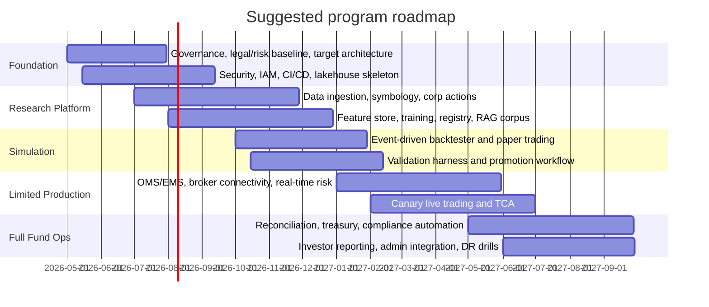

# Automated LLM Quant Trading and Hedge Fund Platform

## Executive summary

A real hedge fund is not just a signal model attached to a broker API. It is a front-office research and trading stack, a middle-office risk and compliance stack, and a back-office fund-operations stack, all wrapped in governance, investor due diligence, service-provider management, and regulatory recordkeeping. Industry due-diligence standards and regulator materials make clear that allocators and supervisors expect controls over governance, investment process, risk, operations, service providers, and reporting, not just alpha generation. citeturn28search0turn28search2turn28search1turn30search12

The right target architecture is therefore **not** “one giant autonomous LLM.” It is a **multi-layer, policy-constrained automation platform** in which LLMs handle unstructured reasoning, summarization, code generation, research synthesis, prompt-driven workflows, and agentic tool use; conventional ML handles forecasting and classification; optimization engines handle portfolio and execution decisions; and deterministic rules engines enforce risk, compliance, and auditability. In practice, the safest and most effective design is **human-on-the-loop**, not fully human-out-of-the-loop, until the platform has demonstrated stable performance through offline validation, paper trading, controlled capital ramps, and continuous monitoring. citeturn40search1turn40search2turn40search3turn26search2turn26search3turn27search3

The recommended build is a **hybrid architecture**. Put research, training, lakehouse storage, feature stores, model registries, and batch backtests in cloud infrastructure. Put latency-insensitive execution through broker APIs and FIX in managed or near-broker environments. If the target strategy becomes microstructure-sensitive, move the live execution lane into colocation or broker-hosted proximity infrastructure while keeping research and governance in the cloud. Use an event backbone for ingest and replay, a versioned lakehouse for time-travel and reproducibility, an offline/online feature split for ML consistency, and strict model/prompt/version lineage. Apache Kafka, Flink, Airflow, Iceberg, Feast, MLflow, Kubeflow, Ray Serve, and Kubernetes are all strong building blocks for this pattern. citeturn17search12turn17search13turn17search18turn17search19turn16search6turn16search0turn16search1turn16search3turn22search3

For model strategy, the best design is **hybrid**. Use a frontier commercial model for orchestration and high-value reasoning; an open-weight model for cost-sensitive internal workflows; finance-specific NLP models for sentiment, entity, and document tasks; supervised models for alpha and risk estimation; and RL sparingly for constrained execution and allocation problems where a simulator is trustworthy. RAG should be the default for policy, research, and market-structure knowledge that changes over time; parameter fine-tuning should be reserved for narrow, repetitive tasks where latency and cost matter; and agentic tool use should only be enabled behind typed schemas, allow-listed tools, output validators, and policy gates. citeturn40search0turn40search1turn40search2turn40search3turn25search0turn25search2turn25search3turn26search0turn26search2turn26search3turn27search0

If the scope truly includes “everything a real hedge fund does,” the program should be phased. A credible sequence is: foundation and governance, data and research platform, backtesting and paper trading, limited live trading with low autonomy, and only then multi-strategy production with derivatives, treasury, reconciliations, investor reporting, and regulatory automation. A serious institutional build commonly requires **12–30 months**, **10–35 people**, and **mid-seven-figure to low-eight-figure** budget ranges before seed capital, exchange memberships, and legal fund setup are counted. That estimate is consistent with the cost drivers visible in current GPU, storage, market-data, and cloud pricing, plus the staffing breadth implied by fund operations, security, and compliance. citeturn20search7turn20search6turn20search8turn32search2turn32search3turn34search1turn34search2turn34search3turn34search4

## Complete platform feature map

Before designing automation, it helps to map what smart humans and software already do inside a real quant fund.

### Functional domains that must exist

| Domain | What a real fund does | Typical human owners | Core software layer | LLM / automation opportunity |
|---|---|---|---|---|
| Research intake | Form hypotheses, read news, filings, broker notes, market color | CIO, PM, quant researchers | Research portal, notebooks, document store | Research copilot, document Q&A, idea clustering, source-grounded summaries |
| Market and reference data | Collect trades, quotes, depth, corporate actions, symbology, fundamentals, options chains | Data engineering | Feed handlers, lakehouse, data QA | Feed exception triage, schema mapping suggestions, documentation generation |
| Labeling and datasets | Define targets, event windows, regimes, sample weights | Quant research, ML | Label engine, dataset registry | Automated label proposal, weak supervision, dataset audits |
| Feature engineering | Build cross-sectional, time-series, alternative-data, and options features | Quant research, ML | Feature pipelines, feature store | Feature proposal, code synthesis, drift explanation |
| Alpha modeling | Train prediction and NLP models | ML engineers, quants | Training pipelines, model registry | Prompted experimentation, hyperparameter search agents, report drafting |
| Portfolio construction | Turn forecasts into positions under constraints | PM, quant dev | Optimizer, constraint engine | Constraint explanation, scenario narration, committee memos |
| Execution | Decide venue, order type, slicing, timing | Trader, execution quant | OMS/EMS, SOR, algo engine | Order-plan drafting, anomaly explanation, post-trade TCA commentary |
| Risk management | Enforce limits, monitor exposures, margin, drawdown, liquidity | CRO, risk analysts | Real-time risk, stress engine | Alert summarization, scenario generation, escalation playbooks |
| Compliance | KYC/AML, trade surveillance, recordkeeping, reporting | CCO, legal, ops | Compliance workflow, archive, reporting engine | Policy retrieval, surveillance triage, draft reports |
| Fund operations | Reconciliation, NAV/PnL, books/records, subscriptions/redemptions, investor reports | COO, fund ops, administrator | Accounting, reconciliation, CRM/IR tools | Break-resolution assistant, DDQ drafting, investor Q&A drafts |
| Platform engineering | Deploy, monitor, secure, recover | SRE, platform, security | CI/CD, Kubernetes, IAM, observability | Incident co-pilot, RCA drafts, config linting |
| Governance | Review strategy changes, approve production, manage incidents | Investment committee, risk committee | Workflow, ticketing, approvals | Meeting packs, decision logs, evidence collection |

Industry due-diligence materials, regulator guidance, and hedge-fund monitoring references all point to this broader operating model: governance, service providers, risk controls, reporting, operations, and investor-facing processes are not optional extras. citeturn28search0turn28search2turn28search1turn30search12

### Human intelligence replication map

| Human role | Core judgment today | What to automate first | What to keep gated |
|---|---|---|---|
| CIO / PM | Thesis formation, capital allocation, escalation decisions | Research synthesis, committee pack generation, scenario comparison | Final capital allocation and strategy approval |
| Quant researcher | Feature design, experiment design, result interpretation | Data prep, notebook scaffolding, result summarization, ablation generation | Acceptance of new signals and regime assumptions |
| Trader / execution quant | Order slicing, venue choice, handling edge cases | Routine execution for approved strategies, TCA reports, anomaly tagging | Kill-switch events, market-stress overrides, manual blocks |
| Risk officer | Limit setting, scenario approval, breach handling | Routine limit monitoring, exposure narratives, draft stress summaries | Limit policy changes, severe breach disposition |
| Compliance officer | Rule interpretation, suspicious activity assessment | Policy retrieval, surveillance triage, draft filings | Final legal determinations and regulatory sign-off |
| Data engineer | Schema integration, QA, recovery | Connector scaffolding, mapping suggestions, gap reports | Entitlement logic and production release |
| Fund operations | Break investigation, reconciliations, investor materials | Break clustering, reconciliation explanations, DDQ refreshes | NAV sign-off, cash movements, investor onboarding approval |
| SRE / security | Incident response, key control, access governance | Runbooks, alert correlation, RCA drafting | Privileged access, secrets policy, disaster declaration |

The practical automation pattern is therefore: **LLM as analyst, compiler, planner, and explainer; deterministic systems as executor and gatekeeper.** That separation materially reduces prompt-injection and unsafe-action risk. citeturn26search2turn26search3turn27search0turn27search3

## Feature deep dives

### Research and intelligence features

Research automation should sit on top of durable data pipelines, workflow orchestration, versioned tables, feature stores, experiment tracking, and scalable serving. Kafka provides durable event streaming; Flink adds stateful streaming with replay/checkpointing; Airflow orchestrates batch workflows; Iceberg provides snapshot logs and time travel; Feast splits offline and online feature serving; MLflow adds lineage and registry; Kubeflow and Ray support scalable training and serving. citeturn17search12turn17search5turn17search18turn17search19turn16search6turn16search0turn16search1turn16search3

| Feature | Purpose | Inputs → outputs | Tech options | Integration points | Failure modes | Mitigation | Complexity / effort |
|---|---|---|---|---|---|---|---|
| Data ingestion and entitlements | Acquire raw market, reference, news, and alternative data with rights enforcement | Exchange/vendor feeds, APIs, files → raw event topics, bronze tables, replay streams | Direct feeds, Databento, Massive, Intrinio, Alpaca, Kafka/Flink | Symbology, QA, lakehouse, live signal services | Feed gaps, out-of-order ticks, entitlement errors, schema drift | Dual vendors, sequence checks, replay queues, schema contracts, entitlement service | High / High |
| Symbology, reference, and corporate actions master | Create one canonical view of instruments across equities and derivatives | Vendor symbology, exchanges, corp actions → canonical IDs, mappings, adjustment tables | Security master DB, Iceberg tables, vendor reference APIs | Ingestion, backtests, OMS, reconciliations | Bad mapping, stale roll schedules, split/dividend mismatch | Golden-source hierarchy, manual overrides, daily reconciliation | High / High |
| Labeling and event engine | Produce consistent supervised targets and regime/event labels | Tick/bars/news/corp action events → labels, event windows, sample weights | Python/Spark, Qlib-style pipelines, feature DSL | Training, validation, model cards | Leakage, look-ahead bias, inconsistent windows | Purged splits, timestamp audits, immutable dataset specs | High / Medium |
| Feature engineering and feature store | Build reusable offline and online features | Cleaned data, labels → offline feature tables, online feature vectors | Feast, Spark, Flink, vectorized Python/Rust | Training, live inference, risk overlays | Train/serve skew, drift, feature staleness | Feature contracts, online/offline parity tests, freshness SLAs | High / High |
| Dataset registry and versioning | Make every experiment reproducible | Data snapshots, labels, feature definitions → dataset manifests and hashes | Iceberg branching/tagging, object storage, MLflow artifacts | Training, audit, backtests | Non-reproducible experiments, silent data rewrites | Immutable snapshots, run manifests, environment pinning | Medium / Medium |
| Model training orchestration | Train and retune classical ML, NLP, and hybrid models | Datasets, configs, GPUs/CPUs → trained artifacts, metrics, checkpoints | Kubeflow, Ray Train/Serve, MLflow, PyTorch, XGBoost | Feature store, registry, evaluator | Cost blowups, unstable jobs, irreproducible runs | Budget quotas, seed control, checkpointing, batch queues | High / High |
| LLM prompt, RAG, and agent layer | Give models grounded access to internal research, market structure, and policy docs | Prompts, retrieval context, tools → structured plans, code, summaries, decisions-in-draft | OpenAI structured outputs, Claude tool use, vector DB, rerankers | Research UI, approvals, monitoring | Hallucinations, prompt injection, tool abuse, cost spikes | Typed schemas, allow-listed tools, retrieval provenance, policy engine, guardrails | High / Medium |
| Evaluation, validation, and governance | Decide whether a model can be promoted | Training outputs, holdout results, backtests → scorecards, approvals, champion/challenger state | MLflow registry, evaluation harnesses, custom validators | CI/CD, risk review, paper trading | Overfitting, metric gaming, untracked prompt changes | Independent validation, holdouts, prompt/version lineage, rollback | High / High |

### Trading and portfolio features

For live trading, the platform must connect research outputs to real market infrastructure. FIX remains the main institutional messaging standard; TT FIX supports order routing, market data, and drop copy; CQG exposes data and trading APIs for low-latency futures workflows; OPRA and the CTA/SIP infrastructure matter for U.S. options and equities market-data baselines; Alpaca-like APIs are useful for prototypes but not a substitute for institutional market-structure tooling. citeturn7search16turn7search17turn7search21turn8search0turn8search1turn34search3

| Feature | Purpose | Inputs → outputs | Tech options | Integration points | Failure modes | Mitigation | Complexity / effort |
|---|---|---|---|---|---|---|---|
| Backtesting and market simulator | Estimate realistic performance before capital is used | Historical events, corp actions, borrow/fees → PnL paths, fills, risk stats | LEAN, Qlib, vectorbt, Backtrader, custom simulator | Data lake, training, optimizer | Unrealistic fills, no latency model, no options/futures mechanics | Event-driven sim, partial-fill logic, queue/latency models, borrow/margin calendars | High / High |
| Portfolio construction and optimizer | Convert forecasts into target holdings under constraints | Alpha forecasts, covariances, constraints → target weights/orders | PyPortfolioOpt, Riskfolio-Lib, cvxportfolio, custom convex optimizers | Risk, treasury, OMS | Overconcentration, unstable turnover, hidden factor bets | Robust covariance, turnover penalties, hard constraints, scenario tests | High / Medium |
| OMS / EMS / order state machine | Track order intent, state, fills, cancels, and amendments | Target orders, execution responses → authoritative order ledger | FIX, custom OMS, broker SDKs | Risk, execution, reconciliations, surveillance | Orphaned orders, duplicate sends, stale state | Idempotent commands, drop copy, event sourcing, reconciliation loops | High / High |
| Execution algos and smart order routing | Achieve fills while minimizing impact and adverse selection | Order intents, book state, venue signals → child-order schedule and route decisions | TWAP/VWAP/POV/IS algos, venue router, TT/CQG/FIX | Market data, risk, OMS | Toxic fills, queue decay, venue outages | Venue scoring, child-order caps, adaptive throttles, route failover | High / High |
| Real-time market-data bus and online inference | Feed live decisions with bounded latency | Tick/depth/news streams → normalized topics, online features, inference requests | Kafka/Flink, in-memory caches, feature service | Execution, risk, monitoring | Clock skew, backlog, stale features | PTP/NTP sync, freshness budgets, backpressure, hot caches | High / High |
| Broker, exchange, and prime-broker connectivity | Reach the market and downstream service providers | Orders, drop copy, account data → executions, balances, confirms | FIX, TT, CQG, broker APIs, file/API links to PB/admin | OMS, treasury, reconciliations | Session loss, reject storms, account permission issues | Session watchdogs, backup lines, pre-open tests, credential rotation | High / High |
| Paper trading and controlled-live ramp | Bridge research and production safely | Approved strategies, live market data → paper fills, then bounded live orders | Sim broker, shadow mode, canary deployment | Validation, monitoring, governance | Strategy works offline but fails live | Shadow deployment, per-strategy capital caps, staged activation | Medium / Medium |
| Treasury, financing, margin, and collateral | Ensure strategy is actually fundable | Positions, borrow, margin rules, cash → financing view, liquidity actions | Treasury service, PB feeds, collateral engine | Risk, portfolio, fund ops | Margin calls, hard-to-borrow failures, collateral bottlenecks | Borrow pre-checks, liquidity buffers, intraday treasury dashboards | High / High |

### Control, operations, and fund-administration features

Real funds live or die on controls. U.S. and EU rules require preserved records, derivatives reporting in many cases, and algorithmic-trading controls; FATF standards define customer due diligence and recordkeeping expectations; observability stacks like Prometheus, Grafana, and OpenTelemetry are mature enough to make platform-wide telemetry standard engineering practice. citeturn9search1turn9search2turn31search2turn31search3turn9search0turn23search0turn23search1turn23search2

| Feature | Purpose | Inputs → outputs | Tech options | Integration points | Failure modes | Mitigation | Complexity / effort |
|---|---|---|---|---|---|---|---|
| Real-time risk management | Enforce hard limits before and after orders | Positions, Greeks, prices, factor exposures → approvals, blocks, kills | In-memory risk engine, scenario service | Portfolio, OMS, treasury | Limit misses, stale exposure, runaway loss | Pre-trade checks, post-trade reconciles, kill switch, risk heartbeat | High / High |
| Compliance, KYC/AML, and reporting | Satisfy investor onboarding, surveillance, and regulatory obligations | Investor/counterparty data, trades, communications → cases, filings, attestations | KYC vendors, surveillance engine, reporting workflows | OMS, archive, fund ops | False negatives, incomplete reports, sanctions misses | Rules + ML + human review, case queues, evidence retention | High / High |
| Audit trail and recordkeeping | Preserve immutable evidence for models, orders, and communications | Events, configs, approvals, messages → WORM-like archive and replay ledger | Event sourcing, immutable object storage, archive index | Everything | Missing evidence, tampering, timestamp mismatch | Retention policy, signed logs, synchronized clocks, write-once archives | High / Medium |
| Reconciliation, accounting, NAV, and investor reporting | Keep books aligned with brokers, PBs, admins, and investors | Fills, cash, positions, fees → breaks, NAV packs, statements | Reconciliation engine, accounting system, admin interfaces | OMS, treasury, compliance | Breaks compound, fee errors, wrong NAV | Daily triparty reconciliations, break aging SLAs, separation of duties | High / High |
| Monitoring, alerting, and incident response | Detect production degradation fast | Metrics, traces, logs, business KPIs → alerts, incident tickets, runbooks | Prometheus, Grafana, OpenTelemetry, Sentry | Platform, models, risk | Alert floods, blind spots, silent failure | Symptom-based alerts, metamonitoring, runbook automation | Medium / Medium |
| Deployment, CI/CD, IaC, and MLOps/RLOps | Make releases reproducible and auditable | Code, models, configs → tested deployable artifacts | GitHub Actions, Argo CD, Terraform, Kubernetes, MLflow | All platform services | Drift, broken rollouts, undeclared changes | GitOps, pinned manifests, progressive delivery, rollback | High / High |
| Security, IAM, key management, and LLM guardrails | Protect assets, data, and agent actions | Secrets, credentials, identities, prompts → policy decisions, protected services | KMS/HSM, IAM, zero-trust network, content filters | All services | Key leakage, privilege creep, prompt injection | Least privilege, secret rotation, sandboxed tools, output validation | High / High |
| Business continuity, disaster recovery, and FinOps | Survive outages and keep spend controlled | Dependency maps, backup states, cloud bills → DR plans, cost views | Multi-region backups, warm standbys, cost dashboards | Platform, data, ops | Single-region dependency, egress surprise, GPU overspend | DR drills, reserved capacity, cost quotas, architecture reviews | Medium / Medium |

## Architecture and data flows

The recommended reference architecture is **event-driven, versioned, hybrid, and policy-gated**. Direct or vendor market data enters an event bus, is normalized into a versioned lakehouse, and is served both to offline research and online inference. Trained models and prompts move through registry and approval gates into paper and then live deployment. Live orders pass through portfolio, risk, OMS, EMS, and broker/exchange connectors, with drop copy and reconciliations feeding back into accounting and surveillance. That structure aligns with how modern stream processors, lakehouse table formats, feature stores, registries, and GitOps platforms are designed to operate. citeturn17search12turn17search13turn17search19turn16search6turn16search0turn22search1turn22search2turn22search3



### Low-latency lane and high-throughput lane

Not every strategy needs the same operating model.

| Architecture lane | Best for | Typical environment | Strengths | Weaknesses | Recommendation |
|---|---|---|---|---|---|
| High-throughput research lane | Cross-sectional, daily/intraday ML, LLM batch analysis, backtests | Cloud | Elastic GPUs/CPUs, easy orchestration, cheap experimentation | Higher egress/latency, market-data licensing complexity | Default for research and retraining |
| Medium-latency live lane | Intraday stat-arb, options overlays, hedging, routine routing | Near-broker / managed cloud / institutional APIs | Simpler operations, faster time to market | Not suitable for microsecond competition | Best starting point |
| Low-latency live lane | Queue-sensitive execution, HFT-like tactics, market making | Colocation / broker proximity | Better queue position and reaction time | Highest operational and regulatory complexity | Only after real evidence justifies it |

Queue position and adverse selection matter because most electronic markets use price-time priority in limit-order books; speed can directly change fill quality and information leakage risk. citeturn29search6turn29search12turn29search15



### Promotion and rollback flow



## Model stack and governance

### Recommended model strategy

The core research pattern for an automated quant platform should be **hybrid by design**:

- **Commercial frontier LLMs** for orchestration, research synthesis, judgment-heavy analysis, coding help, and evaluator/judge roles.
- **Open-weight LLMs** for cost-controlled internal workflows, private deployment, and short-latency internal agents.
- **Finance-specific language models** for sentiment, summarization, entity extraction, and document understanding.
- **Classical supervised models** for most alpha tasks.
- **RL** only where the simulator is strong enough to justify policy learning.

That recommendation follows both the general LLM literature and the finance-specific literature: the Transformer made scalable sequence modeling practical; RAG improves factual grounding and provenance for knowledge-intensive tasks; LoRA reduces adaptation cost; RLHF-style methods help align outputs to desired behavior; finance-specific models such as BloombergGPT, FinGPT, and FinBERT improve domain performance on certain tasks. citeturn40search0turn40search1turn40search2turn40search3turn25search0turn25search2turn25search3

### Recommended LLMs

| Model | Type | Why it belongs in the stack | Best role |
|---|---|---|---|
| OpenAI GPT-4.1 | Commercial | OpenAI positions GPT-4.1 as improved on coding, instruction following, and long-context understanding; OpenAI’s pricing page also exposes usage costs and tool pricing clearly. citeturn12search0turn37search0 | Research orchestrator, evaluator, code/prompt copilot |
| Anthropic Claude Sonnet 4.5 | Commercial | Anthropic’s system card emphasizes coding, agentic tasks, and computer use; Claude pricing and tool-use accounting are operationally mature. citeturn12search1turn39view0 | Agent workflows, tool use, long-form research, policy-grounded reasoning |
| Google Gemini 2.5 Pro | Commercial | Google describes Gemini 2.5 Pro as a state-of-the-art thinking model for code, math, STEM, and large documents/datasets. citeturn12search2turn12search14 | Large-context reasoning, data-heavy analysis, multimodal review |
| Mistral Large 3 | Open-weight / commercial | Mistral describes it as open-weight, multimodal, and multilingual, with 41B active parameters, 675B total, 256k context, and low API pricing. citeturn13search1turn13search5 | Private deployment, cost-sensitive analyst agents |
| Meta Llama 3 family | Open-weight | Official Meta materials and repo make it a practical open deployment choice with strong ecosystem support. citeturn11search3turn11search7 | Internal copilot, document workflows, local batch tasks |
| Qwen 2.5 | Open-weight | Qwen2.5 spans 0.5B–72B parameters with 128k context and broad permissive licensing for most variants. citeturn12search11turn12search7 | Smaller private agents, multilingual finance tasks |

### Finance-specific model layer

| Model | What it adds | Where to use it |
|---|---|---|
| BloombergGPT | A finance-trained 50B model built on a very large mixed finance/general corpus; useful as evidence that domain pretraining can help finance NLP materially. citeturn25search2turn25search6 | Benchmarking philosophy; internal domain-model design reference |
| FinGPT | Open-source financial LLM framework; explicitly emphasizes automatic data curation and lightweight LoRA-style adaptation. citeturn25search0turn25search1 | Sentiment, forecasting prompts, finance-domain fine-tuning experiments |
| FinBERT | Finance-specific pretrained language model that improved sentiment classification on financial communications. citeturn25search3turn25search7 | Earnings-call, filing, and news sentiment pipelines |

### Fine-tuning versus RAG versus agents

| Pattern | Use when | Avoid when | Recommendation |
|---|---|---|---|
| RAG | Knowledge changes often, provenance matters, internal policy/docs must be cited | The task is purely stylistic or ultra-low latency | Default for research and compliance assistants |
| Fine-tuning / LoRA | Task is narrow, repetitive, and latency/cost sensitive | Knowledge changes constantly | Use for classifiers, structured extractors, style-constrained writers |
| Tool-using agents | The workflow requires fetching, coding, querying, or acting | You cannot constrain tools or validate outputs | Use only behind schemas, allow-lists, and policy engines |
| RL / policy optimization | The simulator captures the real decision environment well | The environment is poorly modeled and reward hacking is likely | Restrict mostly to execution/allocation subproblems |

OpenAI’s structured outputs and Anthropic’s tool-use interfaces are especially useful because they make agent workflows less brittle than plain free-form prompting. citeturn26search2turn26search3

### Evaluation and validation

The evaluation stack should be layered:

| Layer | Metrics / tests |
|---|---|
| Data quality | Completeness, duplicate rate, timestamp monotonicity, feature freshness, vendor cross-checks |
| NLP / LLM tasks | Exact match / F1 for extraction, hallucination rate, citation correctness, retrieval precision, tool-call success rate, cost per task |
| Supervised alpha models | AUC / log loss / RMSE where relevant, feature stability, calibration, information coefficient, turnover-adjusted efficacy |
| Portfolio layer | Return, drawdown, turnover, hit rate, concentration, factor exposures, capacity |
| Execution layer | Arrival shortfall, fill ratio, queue loss, reject rate, slippage, venue toxicity, adverse selection |
| Production reliability | Latency, stale-signal rate, order success rate, recovery time, alert precision |

Backtest quality must be treated as a scientific problem, not a marketing exercise. Deflated Sharpe ratio and the probability of backtest overfitting are useful antidotes to multiple-testing bias and data snooping. citeturn5search0turn5search1

### Quant libraries worth using

| Library | Why it matters |
|---|---|
| LEAN | Modular open-source research/backtest/live-trading engine. citeturn14search0turn14search4 |
| Qlib | AI-oriented quant platform supporting supervised learning, market dynamics modeling, and RL. citeturn14search3turn14search11 |
| vectorbt | Fast vectorized research and parameter sweeps. citeturn14search1 |
| Backtrader | Mature Python backtesting/trading framework. citeturn14search2turn14search14 |
| FinRL | Open framework for financial reinforcement learning. citeturn24search0turn24search1 |
| PyPortfolioOpt | Efficient frontier, Black-Litterman, HRP, and related allocators. citeturn15search0 |
| Riskfolio-Lib | Broad menu of portfolio-risk measures and optimizers. citeturn15search1turn15search17 |
| cvxportfolio | Portfolio optimization plus a more sophisticated market simulator. citeturn15search2turn15search6 |

## Trading controls and operations

### Backtesting framework requirements

A serious backtester needs far more than bars and PnL arithmetic. It needs:

- event-driven processing, not just vectorized bars;
- realistic order books or at least queue-aware fill models for passive orders;
- explicit slippage, fees, borrow costs, exchange rebates, and financing;
- corporate actions and futures roll logic;
- options-specific handling for Greeks, exercise, expiry, and margin;
- latency models and exchange/broker reject behavior;
- scenario, walk-forward, and paper-trading handoff;
- immutable data/model/code versions.

The core reason is structural: queue position, adverse selection, and order-cancellation dynamics can dominate realized execution quality in electronic limit-order markets. citeturn29search6turn29search12turn29search0

### Validation ladder

A robust release ladder should be:

1. **Historical backtest** on untouched snapshots.  
2. **Walk-forward / rolling retrain** with realistic rebalance and retrain cadence.  
3. **Paper trading** on live market data and broker semantics.  
4. **Shadow live** where the strategy acts but does not send capitalized orders.  
5. **Canary capital** with hard risk caps.  
6. **Scaled capital** only after stability, TCA, and ops readiness are proven.

This kind of staged promotion is consistent with the reproducibility and continuous-training ideas in the FinRL / FinRL-Podracer literature and with the practical capabilities of LEAN, Qlib, and cvxportfolio-style engines. citeturn24search1turn24search12turn14search0turn14search3turn15search2

### Execution architecture

| Choice | Use when | Main design choice |
|---|---|---|
| API-first broker execution | Strategy horizon is minutes to days; speed edge is not existential | Simpler OMS/EMS, easier controls, faster launch |
| Institutional FIX / EMS | Multi-asset trading, drop copy, low-touch execution, compliance-grade state | Stronger control surface, better operational discipline |
| Colocated / proximity execution | Microstructure edge depends on queue position and sub-millisecond reaction | Separate ultra-low-latency lane, minimal LLM in hot path |

For derivatives support, futures-style APIs and institutional FIX/EMS stacks are materially more credible than retail-first brokers. TT FIX and CQG expose execution and market-data capabilities that are much closer to the requirements of a fund-grade derivatives lane. citeturn7search16turn7search17turn7search21

### Market data and execution vendor view

| Area | Prototype recommendation | Institutional recommendation | Notes |
|---|---|---|---|
| U.S. equities market data | Alpaca / Massive / Databento | Databento, direct feeds, exchange-licensed sources | CTA/SIP covers consolidated NBBO/trades; direct feeds matter more for speed-sensitive strategies. citeturn8search1turn34search1turn34search3turn34search4 |
| U.S. options data | Alpaca indicative or vendor APIs | OPRA via licensed vendor / institutional feed | Options trading without reliable OPRA-grade data is operationally fragile. citeturn8search0turn34search4 |
| Futures market data | Vendor historical APIs | CQG / TT / direct CME market data paths | Derivatives lane should separate exchange entitlements cleanly. citeturn7search17turn7search21 |
| Execution connectivity | Alpaca for early experiments | FIX, TT, CQG, prime-broker links | Keep a broker-agnostic OMS abstraction from day one. citeturn7search14turn7search16turn7search17 |

### Risk management, compliance, and security

Risk should be continuous and layered:

- **pre-trade**: notional, gross/net, exposure, beta, delta/vega/gamma, concentration, restricted-list, borrow, margin, and kill-switch checks;
- **in-trade**: live PnL, exposure deltas, cancel/reject anomalies, latency spikes;
- **end-of-day / intraday batch**: stress, scenario, liquidity, turnover, and margin utilization;
- **capital/risk governance**: exposure budgets by strategy, venue, and regime.

For market risk, expected-shortfall-style thinking and stressed scenarios are preferable to simplistic point estimates; for liquidity risk, cash buffers, financing capacity, and redemption/funding structure matter. Basel and Federal Reserve materials remain useful design references even when the exact jurisdiction is configurable. citeturn30search0turn30search1turn30search5turn30search7turn30search2

Compliance scope should be treated as **configurable by jurisdiction**, but the platform should be able to support at least the following patterns from day one:

- **Customer due diligence / AML** aligned to FATF-style requirements. citeturn9search0
- **Broker/dealer-style or trading-record retention** with preserved electronic records. citeturn9search1turn9search2
- **Derivatives trade reporting** where applicable, such as EMIR-style trade-repository flows. citeturn31search2turn31search13
- **Order recordkeeping and clock synchronization** where MiFID-like rules apply. citeturn31search3turn31search14
- **Private-fund reporting and disclosures** where applicable, such as Form PF in the U.S. private-fund context. citeturn31search0turn31search1turn31search8

Security should be built to a finance-grade baseline:

- encryption in transit and at rest;
- key-management under centralized KMS/HSM policy;
- least-privilege IAM and secret rotation;
- zero-trust network segmentation;
- audited change management;
- immutable logs and WORM-like retention where required;
- software supply-chain controls in CI/CD;
- LLM-specific defenses against prompt injection and over-privileged tools.

NIST SP 800-57 covers key-management best practices; NIST SP 800-53 provides control families including audit, access, incident response, and supply-chain security; CISA’s zero-trust model is a good architectural reference; the AICPA SOC 2 Trust Services Criteria are a useful control target; and OWASP’s LLM Top 10 is the best concise reference for prompt injection and related GenAI risks. citeturn10search0turn10search1turn10search2turn10search3turn27search0turn27search3

## Deployment, costs, and roadmap

### Cloud versus on-prem

The economics depend on utilization and latency.

| Build area | Cloud-first view | On-prem / colo view | Recommendation |
|---|---|---|---|
| Research training | Best for bursty GPU and experiment-heavy work | Better only when utilization is very high and stable | Start cloud-first |
| Live execution | Fine for medium-latency strategies | Better for queue-sensitive or HFT-like tactics | Start cloud/near-broker; move only if alpha proves need |
| Compliance archive and analytics | Strong fit for cloud object storage and lakehouse | Rarely benefits from on-prem | Keep mostly cloud |
| Secrets / privileged control-plane | Cloud native is fine with good IAM/KMS | On-prem HSM can be justified for stricter environments | Depends on jurisdiction and internal policy |

### Indicative infrastructure cost anchors

These are **budget anchors**, not quotes. Prices vary by region, contract, and date.

| Cost driver | Public benchmark | Indicative price anchor |
|---|---|---|
| Large cloud GPU training node | AWS p5.48xlarge, 8× H100, 192 vCPU, 2 TiB RAM, 3200 Gbps | about **55.04/hour** in public instance tracking, with AWS officially documenting the H100-based p5 family and specs. citeturn18search0turn20search7 |
| Azure H100 node | ND96isr_H100_v5, 8× H100, 96 vCPU, 1900 GiB RAM | about **98.32/hour** in public instance tracking, with Azure officially documenting the series and specs. citeturn19view3turn20search6 |
| GCP H100 node | a3-highgpu-8g, 8× H100 | about **87.83/hour** in public instance tracking, with Google officially documenting A3 H100 families and separate GPU pricing rules. citeturn19view2turn20search8 |
| Alternative cloud GPU | Lambda H100 SXM 80 GB | **3.99/GPU/hour** on demand. citeturn32search2 |
| On-prem H100 server anchor | Exxact 4U HGX H100 server configuration | around **172,606** for a public 4×H100 configuration before rack, networking, cooling, and support contracts. citeturn32search3 |
| AWS block storage | EBS gp3 | official example page uses **0.08/GB-month** as a regional example, plus IOPS/throughput charges above baseline. citeturn36search0 |
| GCP object storage | Standard regional storage | about **0.000027397/GiB-hour**, roughly **0.02/GiB-month** in Iowa. citeturn35view2 |
| Azure Blob hot storage | Hot tier object storage | Azure publicly shows Hot/Cool/Archive tiering and per-GB-month pricing structure. citeturn21search3turn35view3 |

### Market-data and vendor cost anchors

Market-data licensing often dominates software budgets faster than model inference does.

| Vendor / source | Public pricing signal | Meaning for planning |
|---|---|---|
| Massive | starts around **49/month** for individual plans | Fine for prototyping, not a substitute for institutional licensing. citeturn34search1 |
| Alpaca Algo Trader Plus | **99/month** plan with real-time market-data access and unlimited API calls at that tier | Good prototype / research lane for U.S. equities/options. citeturn34search3 |
| Intrinio | public packages including **1,250/month** equities and **2,500/month** real-time OPRA options; some news/fundamental packages priced annually | Good for transparent mid-market budgeting. citeturn34search2 |
| Databento | usage-based; exchange licensing listed separately | Often better for controlled usage and replay-heavy workflows. citeturn34search0turn35view5 |
| Databento exchange license examples | OPRA **2,000/firm + 1,500 distribution**; Nasdaq TotalView-ITCH **1,610/firm + 4,020 distribution** | Non-display and distribution fees can dwarf API-engineering cost. citeturn34search4 |

### LLM API cost anchors

For LLM-heavy workflows, planning should separate **interactive high-value reasoning** from **batch extraction and evaluation**.

| Provider | Public anchor |
|---|---|
| OpenAI | GPT-5.5 pricing publicly listed at **5 input / 30 output per 1M tokens**, with batch discounts and separate tool pricing. citeturn37search0 |
| Anthropic | Claude Sonnet 4.5 publicly listed at **3 input / 15 output per 1M tokens**, with prompt caching and batch discounts. citeturn39view0 |
| Gemini | Google’s Gemini pricing page lists token-based pricing plus optional grounding/search charges. citeturn11search2 |
| Mistral Large 3 | Mistral publicly lists low token pricing for its open-weight flagship. citeturn13search1 |

### Phased implementation roadmap



| Phase | Main deliverables | Team size | Indicative budget |
|---|---|---:|---:|
| Foundation | governance model, architecture, security baseline, lakehouse skeleton, CI/CD | 6–9 | 0.8M–1.5M |
| Research platform | feeds, symbology, datasets, feature store, training, registry, RAG corpus | 8–14 | 1.5M–3.0M |
| Simulation and paper trading | event-driven backtester, paper broker, validation harness, dashboards | 10–16 | 2.0M–4.0M |
| Limited production | OMS/EMS, live risk, one or two approved strategies, canary live use | 12–22 | 3.0M–7.0M |
| Full fund operations | reconciliations, treasury, compliance workflows, investor/admin rails, DR | 18–35 | 5.0M–12.0M+ |

These ranges are synthesis, not vendor quotes. They are driven by the documented cost of GPU infrastructure, market-data licensing, and the reality that a fund-grade stack needs platform, quant, trading, risk, compliance, security, and operations roles simultaneously. citeturn20search7turn20search6turn20search8turn32search2turn32search3turn34search2turn34search4

### Recommended team composition

| Role | Why needed |
|---|---|
| CIO / PM | Investment thesis, capital allocation, final accountability |
| Head of Quant Research | Signal framework, validation standards |
| Quant researchers | Alpha design, feature engineering, experimentation |
| ML / LLM engineers | Training, evaluation, agent systems, inference |
| Data engineers | Feed handlers, lakehouse, quality, symbology |
| Quant developers | Simulator, optimizer, OMS/EMS, execution logic |
| Execution engineer / electronic trader | Venue behavior, broker integration, TCA |
| Risk engineer / analyst | Limits, scenarios, stress, intraday exposure |
| Compliance officer / legal | Jurisdiction-specific policy, surveillance, filing sign-off |
| Fund operations / finance / treasury | Recons, cash, fees, financing, NAV support |
| Platform / SRE | Runtime reliability, deployments, incident response |
| Security engineer | IAM, secrets, audit, model/tool security |
| Product / COO | Program integration, service-provider management, investor/DDQ workflows |

### Open questions and limitations

Some design choices should stay configurable because your prompt explicitly leaves them open:

- regulatory jurisdiction and licensing perimeter;
- target latency and whether a colocated lane is economically justified;
- prime broker / administrator / custodian selection;
- whether the vehicle is a private fund, SMA platform, proprietary trading entity, or hybrid;
- whether “completely automated” means **fully autonomous trading decisions** or **fully automated operating workflows with governed approvals**.

Those choices materially change execution architecture, compliance scope, staffing, and budget.

## Feature map markdown

The block below is a ready-to-save `feature_map.md` file.

```md
| Feature | Description | Priority | Dependencies | Owner | Status |
|---|---|---|---|---|---|
| Research intake portal | Central workspace for hypotheses, notes, documents, and experiment requests | High | IAM, document store, vector index | Product / Research | Planned |
| Market data ingestion | Collect trades, quotes, depth, and bars from exchanges/vendors | High | Entitlements, event bus, storage | Data Eng | Planned |
| Reference data master | Canonical instruments, symbology, corp actions, contract metadata | High | Market data ingestion | Data Eng | Planned |
| News and document ingestion | Collect filings, transcripts, news, research notes, alt data text | High | Object storage, vector index | Data Eng / ML | Planned |
| Data QA and normalization | Validate, dedupe, align timestamps, normalize schemas | High | Ingestion, reference master | Data Eng | Planned |
| Lakehouse storage | Bronze/silver/gold storage with versioning and time travel | High | Object storage, table format | Platform / Data Eng | Planned |
| Labeling engine | Generate targets, regimes, event windows, and sample weights | High | Lakehouse, reference master | Quant Research | Planned |
| Feature pipelines | Build reusable alpha, risk, and execution features | High | Labeling, normalized data | Quant Research / ML | Planned |
| Feature store | Offline and online feature serving with train/serve parity | High | Feature pipelines, lakehouse | ML Platform | Planned |
| Dataset registry | Immutable dataset manifests, hashes, and snapshots | High | Lakehouse, feature store | ML Platform | Planned |
| Experiment tracker | Track runs, parameters, metrics, prompts, and artifacts | High | Training infrastructure | ML Platform | Planned |
| Model training orchestration | Schedule and execute ML/LLM training jobs | High | Dataset registry, GPUs/CPUs | ML Platform | Planned |
| LLM RAG layer | Retrieval-grounded assistants for research, policy, and ops | High | Vector index, document ingestion | ML / Applied AI | Planned |
| Prompt management | Version prompts, schemas, eval sets, and tool policies | High | LLM RAG layer, experiment tracker | ML / Applied AI | Planned |
| Model evaluation harness | Offline metrics, regressions, robustness, and cost tests | High | Training, experiment tracker | Validation / ML | Planned |
| Model governance workflow | Approval gates, champion/challenger, rollback controls | High | Evaluation harness, registry | Risk / ML / COO | Planned |
| Backtesting engine | Event-driven historical simulation with realistic fills and costs | High | Lakehouse, reference master | Quant Dev | Planned |
| Paper trading engine | Live market data with simulated brokerage semantics | High | Backtester, broker connectors | Quant Dev / Platform | Planned |
| Portfolio optimizer | Translate forecasts into holdings under constraints | High | Signals, risk models | Quant Research / PM | Planned |
| Signal service | Serve approved models to portfolio and execution layers | High | Registry, feature store | ML Platform | Planned |
| Real-time risk engine | Pre-trade and post-trade limits, exposure, Greeks, drawdown | High | Signal service, OMS, pricing | Risk Eng | Planned |
| OMS | Manage parent/child orders and order lifecycle state | High | Portfolio optimizer, risk engine | Execution Eng | Planned |
| EMS / execution algos | Route and slice orders by venue and market state | High | OMS, market data bus | Execution Eng | Planned |
| Broker / FIX connectors | Connect to brokers, EMS, PB, and exchanges | High | OMS, secrets, network | Execution Eng / Platform | Planned |
| Market data bus | Real-time pub/sub for live signals, risk, OMS, and monitoring | High | Feed handlers | Platform | Planned |
| Smart order routing | Venue selection and routing policy by cost/liquidity profile | Medium | EMS, venue analytics | Execution Eng | Planned |
| Treasury and margin engine | Monitor cash, financing, borrow, collateral, margin | High | OMS fills, PB feeds | Fund Ops / Risk | Planned |
| Trade surveillance | Detect suspicious patterns, breaks, and restricted activity | High | OMS, archive, policy rules | Compliance | Planned |
| KYC / AML workflow | Investor and counterparty onboarding, checks, case management | Medium | CRM, sanctions data | Compliance / Ops | Planned |
| Recordkeeping archive | Preserve orders, prompts, model changes, and communications | High | All event streams | Compliance / Platform | Planned |
| Reconciliation engine | Compare internal books with brokers, PBs, and admins | High | OMS, cash/position feeds | Fund Ops | Planned |
| Fund accounting / NAV support | Fee accruals, PnL packs, admin handoff, NAV support | Medium | Reconciliation, treasury | Fund Ops / Finance | Planned |
| Investor reporting | Factsheets, letters, DDQs, data-room outputs | Medium | Accounting, governance records | COO / Investor Relations | Planned |
| Monitoring and alerting | Metrics, logs, traces, business SLAs, on-call alerts | High | All production services | SRE | Planned |
| Incident response automation | Runbooks, triage, RCA drafts, rollback actions | Medium | Monitoring, CI/CD | SRE / Security | Planned |
| CI/CD for code and models | Tested releases for apps, infra, data, and model configs | High | Git, registries, K8s | Platform | Planned |
| IaC / GitOps | Declarative infrastructure and deployment source of truth | High | CI/CD | Platform | Planned |
| Security and IAM | Least privilege, secrets, key management, access reviews | High | Identity provider, KMS | Security | Planned |
| LLM guardrails | Output schemas, tool policies, prompt-injection defenses | High | Prompt management, agent layer | Security / Applied AI | Planned |
| DR / business continuity | Backup, restore, warm standby, dependency failover | High | IaC, storage, runbooks | Platform / COO | Planned |
| Cost / FinOps | Spend guardrails for GPUs, data, storage, and egress | Medium | Billing data, CI/CD | Platform / COO | Planned |
| Governance workflow | Strategy approvals, model committees, incident reviews | High | Registry, archive, ticketing | COO / Investment Committee | Planned |
```

