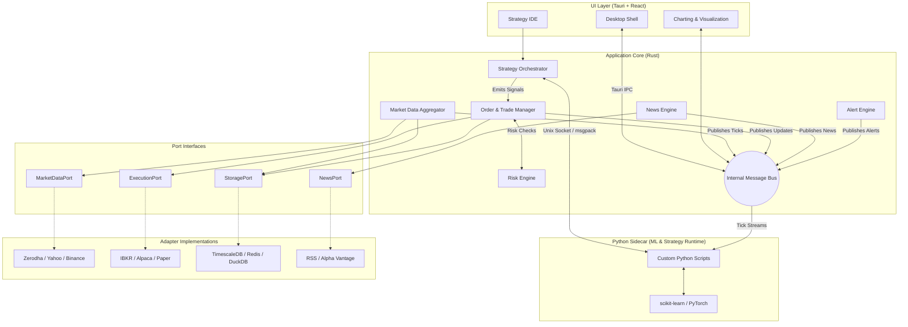

# APEX System Architecture

## Executive Summary

APEX is a high-performance, locally-hosted algorithmic trading terminal engineered for absolute speed, reliability, and data privacy. Designed for institutional-grade quantitative trading without the institutional lock-in, APEX executes completely on the local machine to avoid latency overheads and protect proprietary algorithms and portfolio data.

The system features sub-millisecond internal messaging, lock-free concurrency in its critical paths, and an aggressively optimized rust core. Its primary responsibilities include ingesting high-throughput market data from diverse sources, rapidly computing technical indicators and machine learning model inferences, enforcing strict pre-trade risk validations, and dispatching orders via a unified broker adapter interface.

## System Architecture Diagram

## Design Philosophy

### Hexagonal Architecture (Ports & Adapters)
APEX isolates all business logic from external dependencies using the Ports & Adapters pattern. The core domain defines Rust traits (**MarketDataPort**, **ExecutionPort**, **StoragePort**, **NewsPort**) that define *what* the system needs. Adapters implement *how* those needs are fulfilled (e.g., fetching from Zerodha, storing in TimescaleDB). Adding a new broker or data feed requires zero changes to the core trading engine.

### Speed First, Ergonomics Second
The critical path—from receiving a market data tick to emitting an execution signal—must execute in under 1 millisecond. To achieve this, APEX employs:
*   **Lock-free Data Structures:** `crossbeam` queues and atomic operations prevent thread contention on the hot path.
*   **Asynchronous I/O:** `tokio` manages thousands of concurrent data streams without blocking execution threads.
*   **In-Memory Caching:** Hot state like the **Quote** cache and open positions reside in concurrent `DashMap` instances, bypassing database round-trips for immediate retrieval.

### Fail Loudly, Recover Silently
Reliability is prioritized through aggressive failure containment. Every external adapter is wrapped in a state-machine based Circuit Breaker. If a broker's API degrades, the circuit opens, preventing cascading timeouts and allowing failover logic to take over. The system journals state transitions to SQLite, enabling a silent, consistent recovery of position state upon restart.

### Local-First and Privacy-Centric
All sensitive data—API keys, trading algorithms, portfolio positions, and historical market data—remains strictly on the host machine. The system integrates embedded and local databases (DuckDB, SQLite, local Redis, TimescaleDB) to deliver analytical capabilities matching cloud-hosted platforms without the data exfiltration risks.