# Component Guide

## 1. MarketDataAggregator

### Purpose
The **MarketDataAggregator** is the sensory cortex of the APEX terminal. It manages concurrent connections to multiple external market data adapters, normalizes incoming data into standardized **Tick** and **Quote** objects, maintains an in-memory cache of the latest quotes, and orchestrates the batched persistence of tick data to long-term storage.

### Dependencies
*   **MessageBus**: For publishing `TickData` and `QuoteData` events to other components.
*   **MarketDataPort**: External interface trait for real-time market subscriptions.
*   **StoragePort**: External interface trait for batched persistence.
*   **DataQualityChecker**: Internal component for tick validation.

### Edge Cases & Error Handling
*   **Adapter Failures:** Adapter subscription failures are logged and gracefully skipped; the aggregator will continue processing other adapters. If no adapters successfully subscribe, it fails loudly and bubbles up the final error.
*   **Invalid Data:** Incoming ticks are evaluated against the **DataQualityChecker**. Ticks failing validation (e.g., impossible prices, negative volume) are immediately dropped before hitting the cache or the message bus.
*   **Storage Latency:** Tick writes to storage are performed asynchronously in a background batched task (every 100ms) to prevent slow database operations from blocking the real-time processing of the hot path.

### Internal Flow
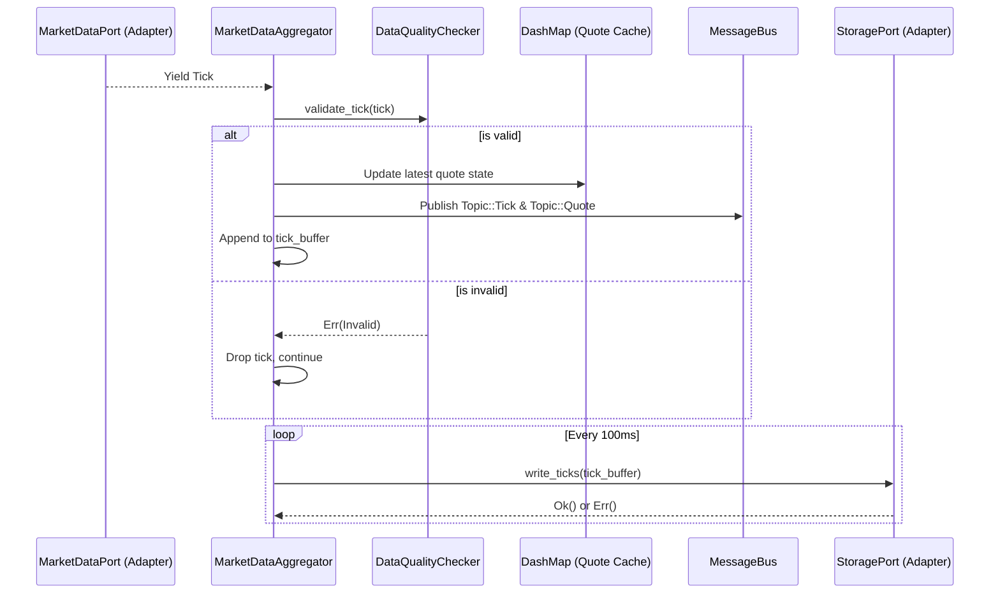

## 2. OrderTradeManager

### Purpose
The **OrderTradeManager** (OTM) manages the entire lifecycle of trading orders. It processes incoming order intents, coordinates strict pre-trade risk validations, dispatches valid orders to the appropriate execution adapter, and processes asynchronous execution responses (fills, cancellations) to update internal positions and P&L.

### Dependencies
*   **RiskEngine**: For strict pre-trade validation of all order intents.
*   **MessageBus**: For publishing state changes (`OrderUpdate`, `PositionUpdate`).
*   **ExecutionPort**: External interface trait for routing orders to brokers.

### Edge Cases & Error Handling
*   **Risk Rejections:** If the **RiskEngine** rejects an order (e.g., maximum daily loss exceeded, position sizing too large), the OTM immediately rejects the order and returns an error without consulting the broker.
*   **Adapter Outages:** If the corresponding execution adapter is unavailable or missing, the order is aborted with an error.
*   **State Discrepancies:** The OTM employs a periodic reconciliation loop (e.g., every 30 seconds) that compares local position state with the broker's authoritative state, automatically rectifying local discrepancies.

### Internal Flow
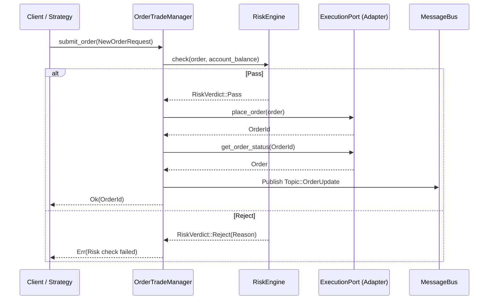

## 3. RiskEngine

### Purpose
The **RiskEngine** acts as a high-speed, synchronized circuit breaker for all trading activity. It protects capital by evaluating every `NewOrderRequest` against defined limits: maximum order value, maximum position percentage, daily loss thresholds, and rapid duplicate order detection.

### Dependencies
*   None (Operates primarily on in-memory atomic configurations and session state).

### Edge Cases & Error Handling
*   **Max Daily Loss:** If session P&L breaches the configured maximum daily loss threshold, the engine immediately sets an atomic `trading_halted` flag. Once halted, all subsequent orders are universally rejected until a manual reset is explicitly invoked by the user.
*   **Duplicate Orders:** Prevents fat-finger errors or runaway algorithms by rejecting identical orders submitted within a rapid, configurable time window (e.g., 500ms).

### Internal Flow
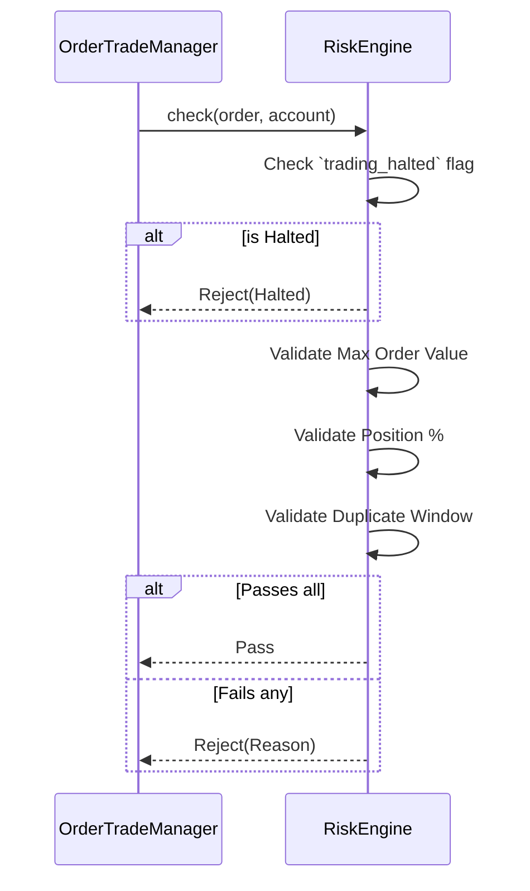

## 4. GraphEngine

### Purpose
The **GraphEngine** manages the custom vector and relationship modeling system. It constructs a directed graph of instruments, sectors, and macro variables, allowing for the calculation and traversal of complex correlations and categorizations (e.g., `CorrelatedWith`, `BelongsTo`, `LeadsBy`).

### Dependencies
*   `petgraph`: Core graph data structure library utilized under the hood.

### Edge Cases & Error Handling
*   **Dangling Edges:** Attempting to add an edge where the source or target node does not exist is safely rejected.
*   **Stale Correlations:** It filters correlation calculations to explicitly process only nodes tagged as `NodeType::Instrument`.

### Internal Flow
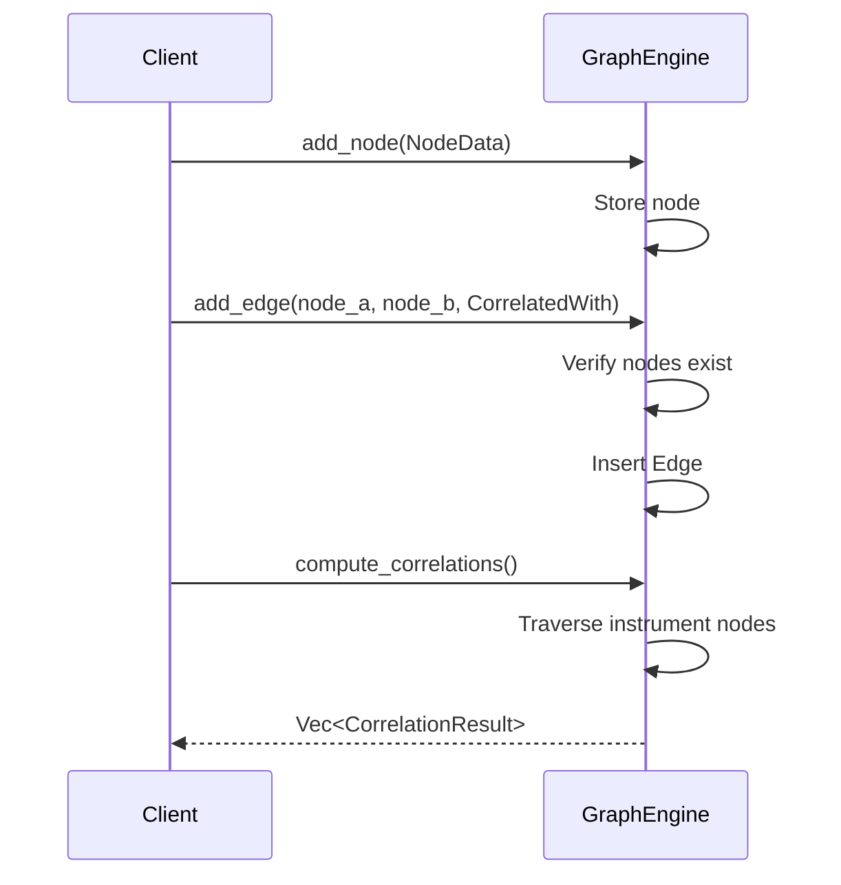

## 5. StrategyOrchestrator

### Purpose
Manages the lifecycle, execution, and monitoring of isolated Python algorithmic trading scripts. It spawns, tracks, pauses, and terminates child processes, acting as the bridge between Rust's core execution and the Python strategy logic via inter-process communication (IPC).

### Dependencies
*   Python 3 Environment (External Process)
*   **MessageBus**: For routing signals to the OTM.

### Edge Cases & Error Handling
*   **Zombie Processes:** Implements graceful termination using `.kill()` and explicitly calls `.wait()` to reap zombie processes.
*   **Silent Crashes:** Contains a background health check loop that periodically probes running child processes. If a strategy process exits unexpectedly, it updates the internal state to `Failed` and records the exit status.

### Internal Flow
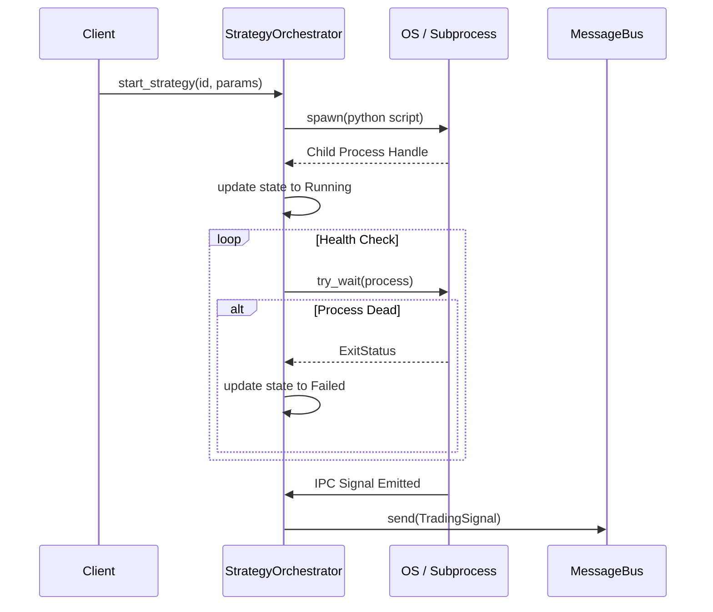

## 6. NewsEngine

### Purpose
Aggregates, deduplicates, and enriches RSS and Atom news feeds. It polls external feeds, extracts ticker symbols from the text, and calculates a financial-domain sentiment score before publishing the enriched news to the message bus.

### Dependencies
*   **MessageBus**: Publishes `News` events.
*   **Sentiment**: Internal module for NLP sentiment calculation.

### Edge Cases & Error Handling
*   **Feed Errors:** If a specific feed URL fails or times out, the error is logged but the polling loop continues processing the remaining feeds.
*   **Duplicate News:** Maintains an LRU-style cache (bounded to 10,000 items). New items are cross-referenced by URL and dropped if they are already known.

### Internal Flow
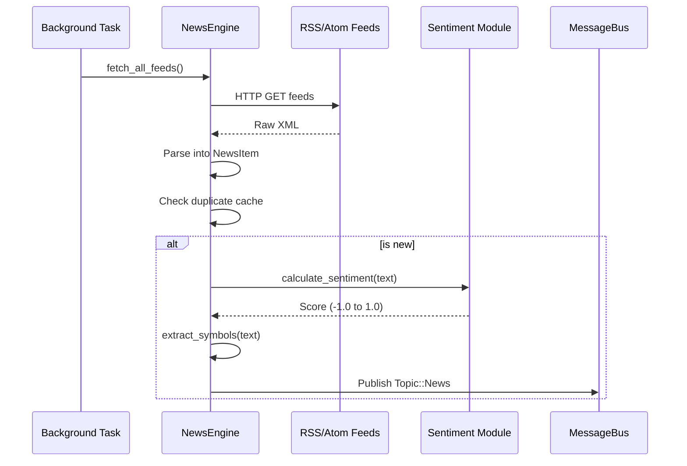

## 7. AlertEngine

### Purpose
Evaluates real-time market data (**Quote**) and system state (e.g., Daily P&L) against user-defined alert rules. When a condition is met, it fires an alert message onto the system bus for UI notification or sound playback.

### Dependencies
*   **MessageBus**: For publishing triggered **AlertFired** events.

### Edge Cases & Error Handling
*   **Disabled Rules:** Safely bypasses any rule explicitly marked as `enabled: false`.
*   **Concurrent Access:** Uses `RwLock` to allow high-speed, concurrent reads during tick processing while safely supporting asynchronous additions/removals of rules.

### Internal Flow
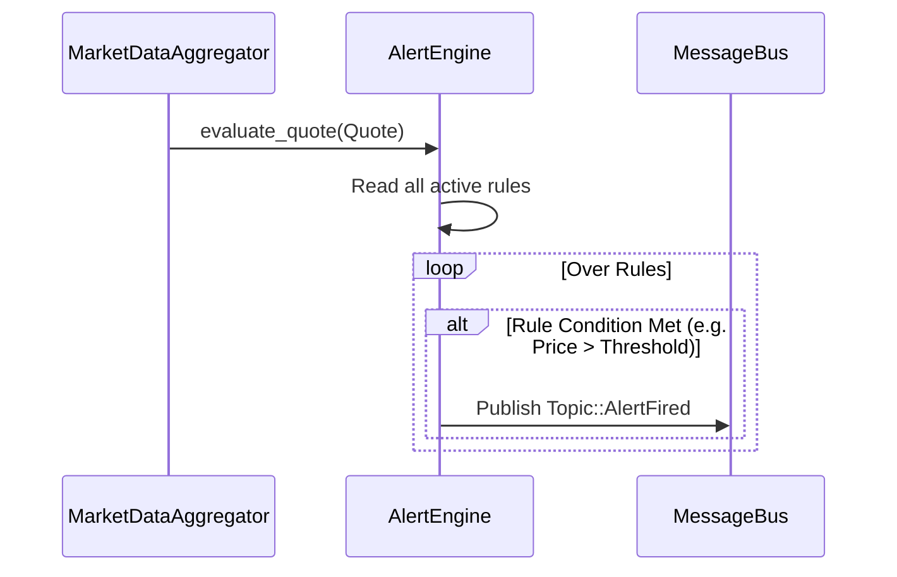

## 8. BacktestEngine

### Purpose
Simulates trading strategy execution against historical **OHLCV** data to calculate performance metrics (Sharpe ratio, Max Drawdown, Win Rate). It strictly steps through time to prevent lookahead bias and applies configurable commission and slippage models.

### Dependencies
*   Historical Data **OHLCV** inputs.

### Edge Cases & Error Handling
*   **Lookahead Bias Prevention:** The engine evaluates the strategy using strictly historical state up to time `t`, and executes fills conservatively on the `open` price of the *following* bar `t+1`.
*   **Walk-Forward Out of Bounds:** When configuring walk-forward optimization, it guards against invalid parameters (e.g., 0 windows, train percentage > 1.0) by returning immediate errors.

### Internal Flow
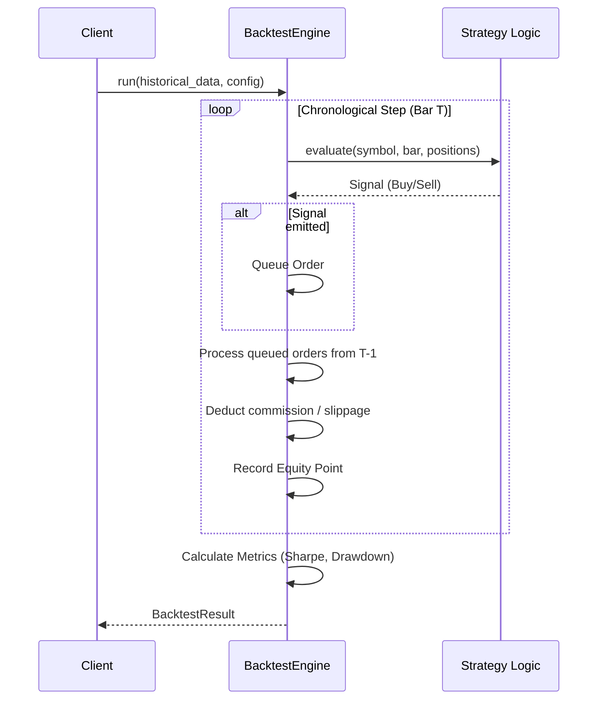

## 9. CircuitBreaker

### Purpose
A resilient, generic state machine applied to all external I/O (Broker Adapters). It prevents network degradation from causing cascading application failures by opening the circuit upon consecutive errors and periodically testing recovery via a half-open state.

### Dependencies
*   None.

### Edge Cases & Error Handling
*   **Rapid Failures:** Once the failure threshold is crossed in the `Closed` state, the circuit transitions to `Open` and immediately rejects all execution attempts, protecting the system from hanging threads.
*   **Testing Recovery:** In `HalfOpen`, only one call is permitted through. If it fails, the breaker immediately reverts to `Open`. It requires a specified number of consecutive successes to fully transition back to `Closed`.

### Internal Flow
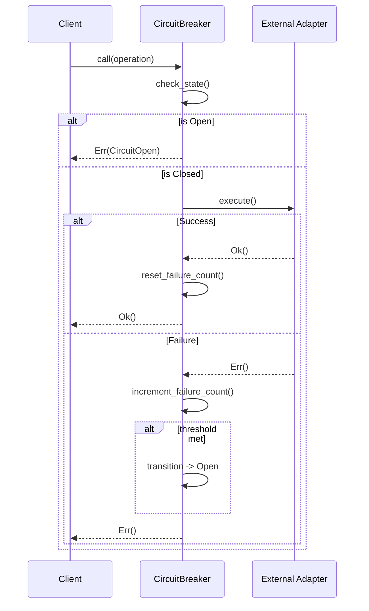

## 10. DataQualityChecker

### Purpose
Performs rigorous validation on incoming **Tick** and **OHLCV** data to ensure integrity before it is cached, analyzed, or displayed.

### Dependencies
*   None (Operates primarily as a pure function module using `chrono` for time gap checks).

### Edge Cases & Error Handling
*   **Impossible Prices:** Rejects prices less than or equal to 0, or astronomically high integers indicative of parsing errors.
*   **Invalid OHLC Structures:** Drops bars where relationships are mathematically impossible (e.g., `high < low`, or `close` outside the high/low range).
*   **Anomaly Detection:** Flags sudden price spikes outside a configured maximum percentage threshold for further review.

### Internal Flow
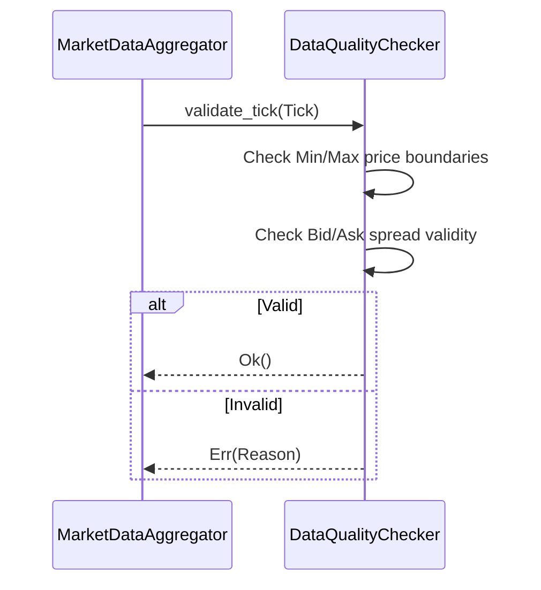

## 11. Indicators

### Purpose
A highly optimized, pure-math module providing technical analysis functions like SMA, EMA, RSI, MACD, Bollinger Bands, ATR, VWAP, and Stochastic Oscillators.

### Dependencies
*   None (Pure Rust math functions).

### Edge Cases & Error Handling
*   **Insufficient Data:** Functions gracefully handle cases where the input data is shorter than the required period by returning empty arrays or safely truncating the result, rather than panicking.
*   **Invalid Parameters:** Evaluates period arguments. If `period = 0` is supplied, it returns an explicit error to prevent divide-by-zero panics.

### Internal Flow
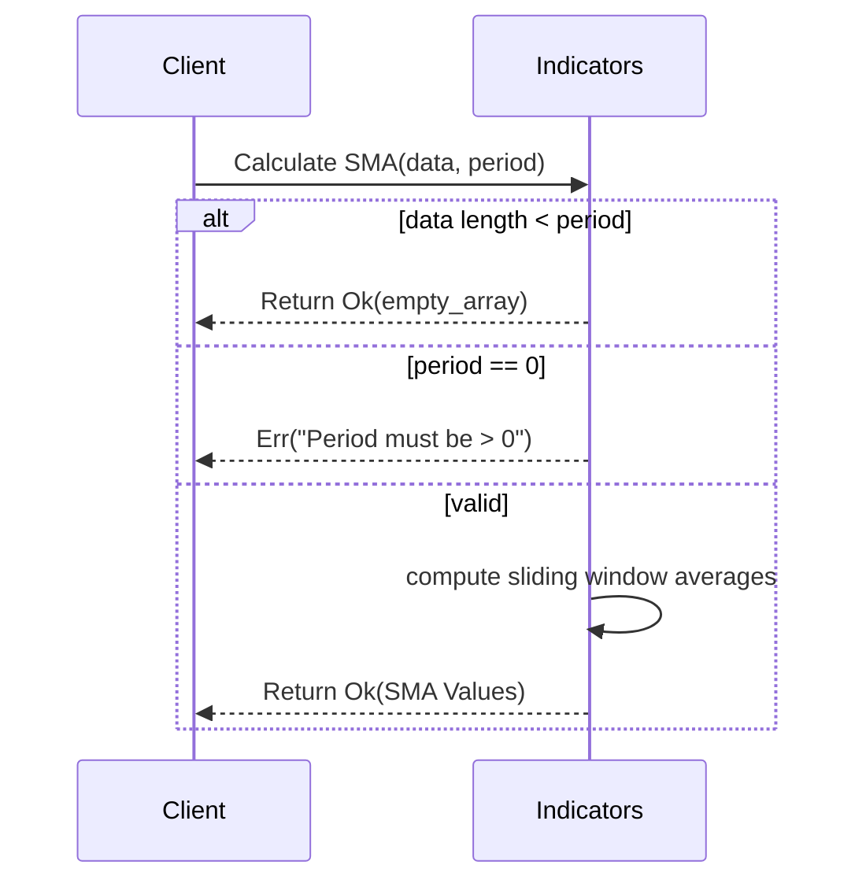

## 12. Metrics

### Purpose
Wraps the `prometheus` crate to expose deep systemic telemetry. It registers counters, gauges, and histograms for ticks processed, orders filled, storage latencies, and cache sizes.

### Dependencies
*   `prometheus`: External crate for metric registry and export.

### Edge Cases & Error Handling
*   Prometheus registry collision is prevented by instantiating metrics once and passing the configured registry atomically across the system.

### Internal Flow
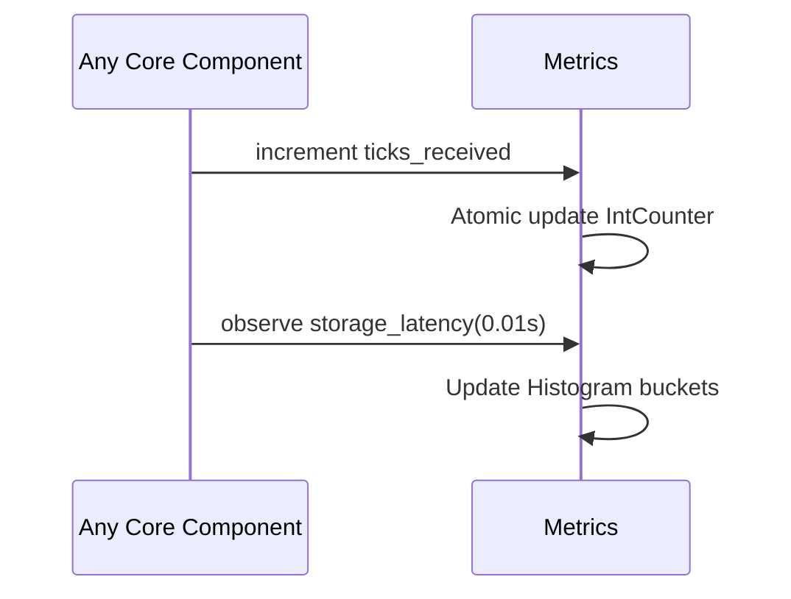

## 13. Scanner

### Purpose
Evaluates a universe of instruments against user-defined technical criteria (e.g., Price > SMA, Volume > Threshold, RSI < 30).

### Dependencies
*   **MarketDataPort**: For fetching snapshot quotes and historical **OHLCV** bars.
*   **Indicators** Module: For calculating technical values against historical data.

### Edge Cases & Error Handling
*   **Optimization:** It evaluates computationally cheap criteria first (e.g., current price comparisons). Only if those pass does it execute the expensive historical fetches and indicator calculations, significantly reducing CPU load on broad universe scans.

### Internal Flow
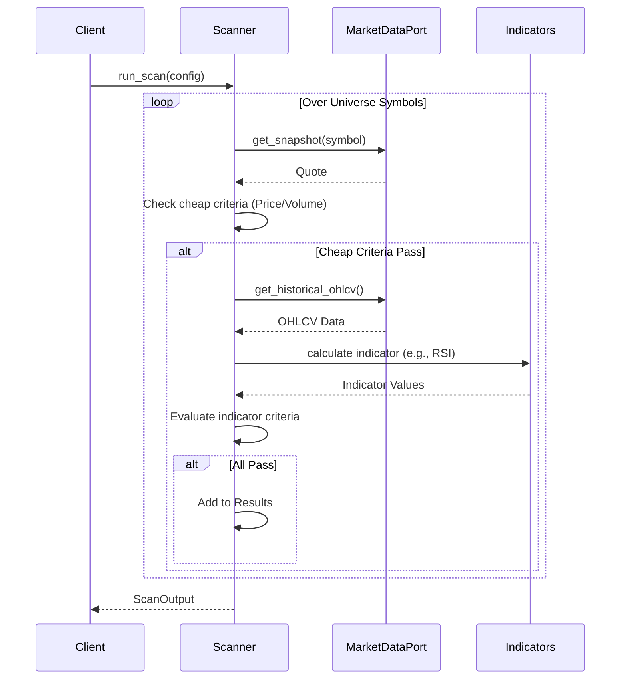

## 14. Sentiment

### Purpose
Provides a domain-specific variant of the VADER sentiment algorithm, heavily tuned for financial terminology.

### Dependencies
*   None (Operates via hardcoded static lexicons using `LazyLock`).

### Edge Cases & Error Handling
*   **Complex Lexicon Processing:** Accurately parses negations ("not bullish"), degree modifiers ("extremely strong"), and caps-lock intensity ("SURGES") to compute a normalized float between -1.0 and 1.0. Prevents infinite recursion or unbound floats using `clamp(-1.0, 1.0)`.

### Internal Flow
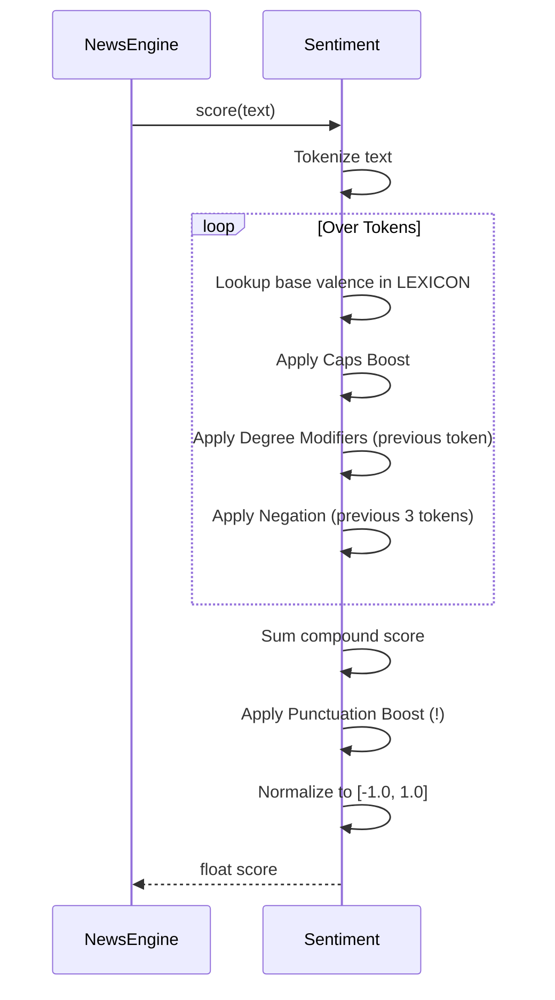