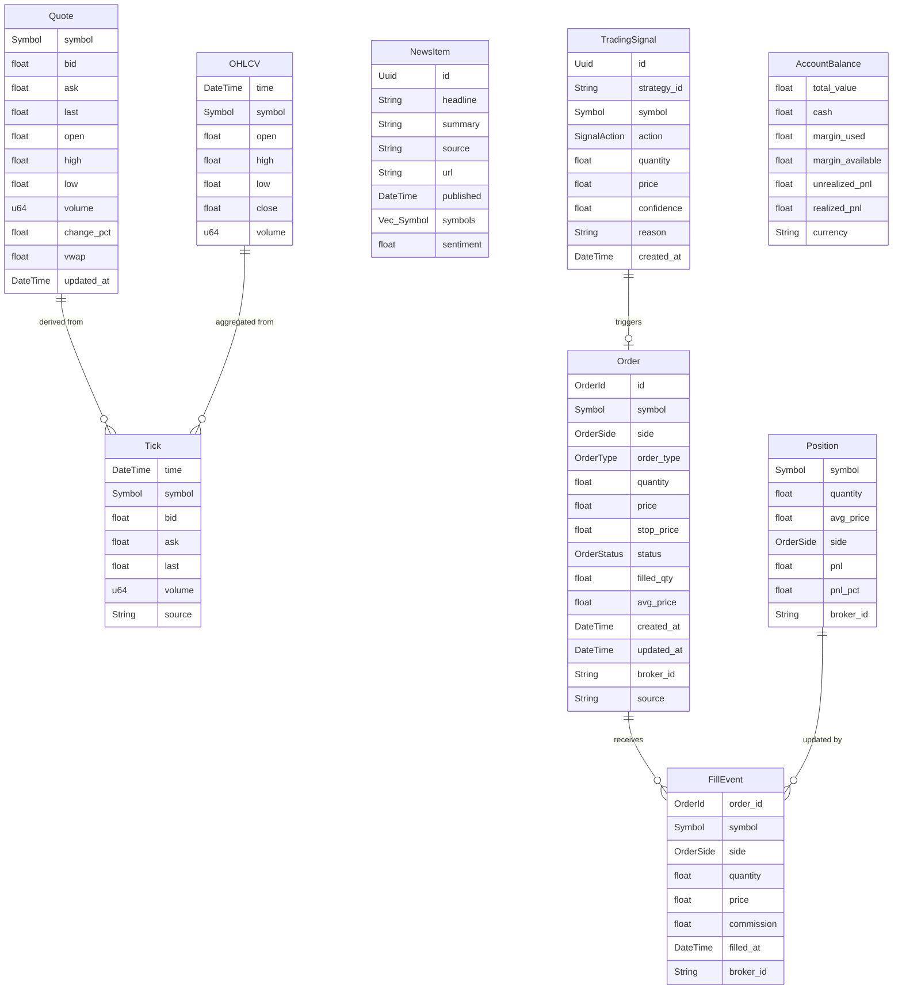

# State & Database Data Flow

## Entity Relationship Diagram

The following diagram maps the core domain entities defined within the system (`apex-core/src/domain/models.rs`).

## Entity Lifecycles

### Order Lifecycle
The **Order** entity tracks the intent and execution of a trade.
1. **Creation:** An order begins when a `NewOrderRequest` is submitted (either manually via UI or automatically via **TradingSignal** from a Strategy). It defaults to a `Pending` state.
2. **Pre-Trade Risk:** Before leaving the system, the order is validated against the **RiskEngine**. If it fails (e.g., exceeds max daily loss), the status shifts to `Rejected` and the lifecycle terminates.
3. **Dispatch:** If valid, the order is routed to the corresponding **ExecutionPort**. Once acknowledged by the broker, its status updates to `Open`.
4. **Execution:** As `FillEvent`s are received from the broker adapter:
    * If `filled_qty < quantity`, the status updates to `PartiallyFilled`.
    * If `filled_qty == quantity`, the status shifts to `Filled` and the lifecycle completes.
5. **Modification/Cancellation:** An `Open` order may be modified or cancelled. Upon a successful cancel request, the status transitions to `Cancelled`.

### Tick to Quote Lifecycle
1. **Ingestion:** Raw bytes from WebSocket streams are decoded by market data adapters into standard **Tick** structs.
2. **Validation:** Ticks are instantly validated by the **DataQualityChecker** to filter out anomalies (e.g., negative prices).
3. **State Mutation:** Valid ticks update the in-memory **Quote** state for that specific `Symbol` inside the **MarketDataAggregator**.
4. **Broadcast:** The updated **Quote** and raw **Tick** are broadcast via the internal **MessageBus**.
5. **Persistence:** Ticks are temporarily held in an asynchronous buffer and batched into TimescaleDB every 100ms.

## Concurrency & State Management

### Hot State vs. Cold Storage
APEX enforces strict segregation between hot, in-memory state and cold, durable storage to protect the critical path latency.
*   **Hot State:** Live quotes, current open positions, and active orders are stored in `DashMap` instances. `DashMap` provides lock-free, highly concurrent read/write access. This allows the UI and **RiskEngine** to retrieve live state in nanoseconds without hitting a database.
*   **Cold Storage:** High-volume data like historical ticks and OHLCV bars are persisted to TimescaleDB. To prevent DB latency from blocking the system, the **MarketDataAggregator** queues ticks in a standard `Mutex<Vec<Tick>>`. A dedicated asynchronous tokio task locks this buffer every 100ms, drains it, and flushes the batch to TimescaleDB.

### Message Bus & Lock-Free Channels
Internal communication relies on the `tokio::sync::broadcast` channels encapsulated within the **MessageBus**.
*   **Fan-out:** A single market data tick is published once but fanned out simultaneously to the UI (via Tauri events), the Python Strategy sidecar, and internal logging processes.
*   **Decoupling:** Modules do not hold references to each other. The **MarketDataAggregator** simply publishes to a topic (`Topic::Tick("AAPL")`); the **StrategyOrchestrator** consumes from it. This prevents race conditions and cascading deadlocks.

### Atomic Operations for Risk
The **RiskEngine** tracks cumulative session P&L and trading halt flags using `std::sync::atomic` primitives (`AtomicBool`, `AtomicU32`).
*   **Zero-Cost Checks:** When checking if the system is halted, the engine executes a fast `load(Ordering::SeqCst)` operation. It does not require Mutexes or RwLocks, ensuring that pre-trade risk validations execute in under 10 microseconds.